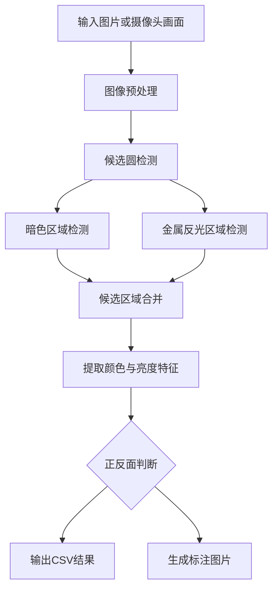

# 电池极片料盘正反面识别实验报告

> 课程：化学自动化  
> 项目名称：电池极片料盘正反面识别  
> 项目类型：视觉识别 / 图像处理  
> 姓名/组员：待填写  
> 日期：2026 年 6 月 25 日  

## 摘要

本项目面向电池极片料盘图像中的正反面识别任务，完成了一个基于 Python 和 OpenCV 的图像识别程序。程序能够读取单张图片、图片文件夹或摄像头画面，自动检测圆形电池极片位置，并根据颜色、亮度和金属反光特征判断极片正反面。项目最终输出带标注的识别图片和 `results.csv` 结果表格，可用于人工复核和课程作业验收。

本项目只实现视觉识别部分，不包含机械抓取、翻面机构、摆盘机构、PLC、机械臂或三轴平台自动控制。根据当前样例图，本组样品中银白/金属反光面按“正面”处理，黑色面按“反面”处理。

## 1. 项目背景

锂电池极片或类似圆形薄片在实验和生产准备过程中常需要区分正反面。若依靠人工检查，不仅耗时，而且容易因反光、遮挡、疲劳等因素产生方向判断错误。原始作业背景中的完整自动化方案包括“识别、抓取、翻面、摆盘”等步骤，而本项目聚焦其中的视觉识别任务：判断料盘图像中每个圆形极片的正反面状态。

参考往届大作业页面的组织方式，本报告按照“方案目标、实验原理、系统组成、实现过程、操作说明、结果展示、问题与改进”的结构撰写，重点提供完整操作说明和已实现目标证据。

## 2. 方案目标

本项目的目标如下：

1. 读取料盘或散料区域的图像。
2. 自动检测图像中的圆形极片。
3. 判断每个极片的正面或反面。
4. 在原图上标注检测圆、中心点、类别和置信度。
5. 输出结构化结果表格，便于统计和复核。
6. 使用独立 Python 环境运行，避免影响主 Python 环境。

不包含的内容如下：

- 自动抓取
- 自动翻面
- 自动摆盘
- 串口控制、PLC 控制或机械臂控制
- 真空吸盘、电磁阀等硬件控制

## 3. 实验原理

### 3.1 图像特征

本项目利用极片正反面在图像中的颜色和亮度差异进行识别：

| 类别 | 图像表现 | 主要特征 |
| --- | --- | --- |
| 正面 | 银白色或金属反光面 | 亮度高，饱和度较低，Lab 颜色空间中偏中性 |
| 反面 | 黑色或深灰色面 | 亮度低，暗色像素占比高 |

如果后续样品正面呈铜色，也可以通过程序中预留的 `copper_ratio` 特征继续扩展。

### 3.2 检测流程

程序采用传统图像处理方法，不依赖深度学习模型。整体流程如下：



### 3.3 核心算法

程序使用三类候选区域来源：

1. **Hough 圆检测**：用于寻找图像中的圆形结构。
2. **暗色掩膜检测**：通过 HSV 阈值检测黑色反面。
3. **金属面掩膜检测**：结合 HSV 与 Lab 颜色空间检测银白金属面，减少纸板背景误判。

每个候选区域会提取以下特征：

- BGR 平均颜色
- HSV 平均色相、饱和度、亮度
- 亮度标准差
- 暗色像素比例 `dark_ratio`
- 亮色像素比例 `bright_ratio`
- 金属面比例 `metallic_ratio`
- 铜色比例 `copper_ratio`

分类规则如下：

- `dark_ratio` 高且平均亮度低：判定为反面。
- `metallic_ratio` 高且平均亮度高：判定为正面。
- 特征不足或冲突明显：判定为未识别。

## 4. 系统组成

### 4.1 软件环境

| 项目 | 内容 |
| --- | --- |
| 操作系统 | Windows |
| Python 环境 | 独立虚拟环境 `disk_reg` |
| 主要依赖 | `opencv-python`、`numpy` |
| 输出格式 | 标注图片、CSV 表格 |

项目使用独立环境 `disk_reg`，不会改动系统主 Python 环境。

### 4.2 项目文件结构

```text
电池极片正反面识别/
├── disk_reg/             # 独立 Python 虚拟环境
├── data/
│   ├── frames/           # 测试图片
│   ├── raw/              # 原始图片预留目录
│   └── samples/          # 示例图片预留目录
├── outputs/
│   ├── images/           # 标注后的图片
│   └── results.csv       # 识别结果表格
├── src/
│   ├── main.py           # 命令行入口
│   ├── detector.py       # 极片检测
│   ├── classifier.py     # 正反面分类
│   ├── models.py         # 数据结构
│   └── utils.py          # 图片读写、标注、CSV输出
├── requirements.txt
├── README.md
└── 电池极片料盘正反面识别实验报告.md
```

## 5. 实现过程

### 5.1 环境隔离

为避免影响主 Python 环境，项目单独创建虚拟环境：

```powershell
python -m venv disk_reg
```

安装依赖时只调用 `disk_reg` 内的 Python：

```powershell
.\disk_reg\Scripts\python.exe -m pip install -r requirements.txt
```

### 5.2 入口程序

入口文件为 `src/main.py`，支持以下输入形式：

- 单张图片
- 图片文件夹
- 摄像头编号

识别单张图片：

```powershell
.\disk_reg\Scripts\python.exe -m src.main --input data\frames\1.jpg --output outputs
```

识别整个文件夹：

```powershell
.\disk_reg\Scripts\python.exe -m src.main --input data\frames --output outputs
```

调用摄像头：

```powershell
.\disk_reg\Scripts\python.exe -m src.main --input 0 --mode camera --output outputs
```

### 5.3 检测模块

检测模块位于 `src/detector.py`。主要功能如下：

- 根据图像尺寸估计合理的圆片半径范围。
- 使用 Hough 圆检测得到圆形候选区域。
- 使用暗色掩膜提取黑色反面区域。
- 使用 HSV + Lab 联合阈值提取银白金属面区域。
- 对重复候选圆进行合并，优先保留完整连通区域。

### 5.4 分类模块

分类模块位于 `src/classifier.py`。程序会对每个候选圆区域提取颜色统计特征，然后输出：

- `front`：正面
- `back`：反面
- `unknown`：未识别

### 5.5 输出模块

输出由 `src/utils.py` 完成：

- 生成标注图片：`outputs/images/1_annotated.jpg`
- 生成结果表格：`outputs/results.csv`

## 6. 实验操作说明

### 6.1 准备图片

将待识别图片放入：

```text
data/frames/
```

当前测试图片为：

```text
data/frames/1.jpg
```

### 6.2 运行识别

在项目根目录执行：

```powershell
.\disk_reg\Scripts\python.exe -m src.main --input data\frames --output outputs
```

运行结束后，终端输出如下：

```text
1.jpg: detected=16
summary: total=16, front=8, back=8, unknown=0
results saved: outputs\results.csv
```

### 6.3 查看结果

标注图片：

```text
outputs/images/1_annotated.jpg
```

结果表格：

```text
outputs/results.csv
```

如果上传到课程网页，建议同时上传标注图片作为“已实现目标证据”。

## 7. 实验结果

### 7.1 总体结果

| 测试图片 | 检测总数 | 正面数量 | 反面数量 | 未识别数量 |
| --- | ---: | ---: | ---: | ---: |
| `1.jpg` | 16 | 8 | 8 | 0 |

程序检测出的极片数量与样例图中人工观察到的可见极片数量一致。

### 7.2 标注结果图


图中绿色圆表示正面，红色圆表示反面。每个圆旁边标注了编号、类别和置信度。

### 7.3 识别明细

| 编号 | 圆心 X | 圆心 Y | 半径 | 判断结果 | 置信度 | 候选来源 |
| ---: | ---: | ---: | ---: | --- | ---: | --- |
| 1 | 556.06 | 335.37 | 103.93 | 反面 | 1.00 | mask_dark |
| 2 | 1198.09 | 395.91 | 101.81 | 反面 | 1.00 | mask_dark |
| 3 | 187.22 | 472.90 | 103.47 | 反面 | 1.00 | mask_dark |
| 4 | 750.85 | 591.53 | 104.12 | 正面 | 1.00 | mask_metal |
| 5 | 498.38 | 625.75 | 105.67 | 正面 | 1.00 | mask_metal |
| 6 | 884.58 | 788.24 | 103.34 | 正面 | 1.00 | mask_metal |
| 7 | 1023.97 | 912.89 | 119.00 | 反面 | 1.00 | mask_dark |
| 8 | 270.41 | 965.93 | 104.59 | 正面 | 1.00 | mask_metal |
| 9 | 442.41 | 999.92 | 112.95 | 反面 | 1.00 | mask_dark |
| 10 | 705.13 | 1137.10 | 103.61 | 正面 | 1.00 | mask_metal |
| 11 | 432.49 | 1337.47 | 104.48 | 反面 | 1.00 | mask_dark |
| 12 | 886.07 | 1340.77 | 102.71 | 正面 | 1.00 | mask_metal |
| 13 | 1126.10 | 1409.02 | 108.15 | 反面 | 1.00 | mask_dark |
| 14 | 615.00 | 1534.00 | 102.00 | 反面 | 1.00 | hough |
| 15 | 875.22 | 1680.33 | 102.40 | 正面 | 1.00 | mask_metal |
| 16 | 505.58 | 1695.73 | 104.21 | 正面 | 1.00 | mask_metal |

## 8. 问题与解决方法

### 8.1 金属反光导致局部误检

在初始版本中，Hough 圆检测会将银白面内部的局部高光区域误识别为多个小圆，导致同一个极片被重复计数。

解决方法：

- 增加金属面连通区域检测。
- 合并重复候选圆。
- 优先保留完整连通区域候选，而不是局部高光圆。

### 8.2 纸板背景与正面亮度接近

样例图片中的纸板背景亮度较高，若只使用 HSV 低饱和高亮阈值，容易将纸板背景误判为正面。

解决方法：

- 引入 Lab 颜色空间。
- 通过 Lab 的 B 通道区分偏黄纸板和偏中性的银白金属面。
- 要求金属面同时满足亮度、饱和度和 Lab 阈值。

### 8.3 边缘遮挡与圆形不完整

部分极片靠近图像边缘或被其他极片遮挡，圆形不完整。

解决方法：

- Hough 圆检测和掩膜轮廓检测并用。
- 对半径范围和圆形度设置较宽容的阈值。
- 对可疑区域保留 `unknown` 类别扩展空间。

## 9. 可复现性说明

项目可通过以下步骤复现：

1. 进入项目根目录。
2. 使用 `disk_reg` 环境安装依赖。
3. 将测试图片放入 `data/frames/`。
4. 运行识别命令。
5. 查看 `outputs/images/` 和 `outputs/results.csv`。

完整命令如下：

```powershell
.\disk_reg\Scripts\python.exe -m pip install -r requirements.txt
.\disk_reg\Scripts\python.exe -m src.main --input data\frames --output outputs
```

如果极片大小或拍摄距离变化较大，可以调整半径比例参数：

```powershell
.\disk_reg\Scripts\python.exe -m src.main --input data\frames --output outputs --min-radius-ratio 0.02 --max-radius-ratio 0.10
```

## 10. 局限性与改进方向

当前项目已经完成单张样例图的正反面识别，但仍存在以下局限：

1. **样本数量较少**：目前只使用一张样例图验证，尚未覆盖更多光照、角度、遮挡情况。
2. **阈值依赖拍摄条件**：如果光源颜色或背景颜色变化较大，需要重新调整阈值。
3. **未加入人工校准界面**：当前通过命令行运行，缺少可视化参数调节界面。
4. **未使用机器学习模型**：传统阈值法可解释性好，但泛化能力弱于训练模型。
5. **未实现实时连续检测**：虽然支持摄像头输入，但尚未设计完整的实时交互流程。

后续可以改进：

- 增加多张图片测试集，统计检测率和分类准确率。
- 增加图形界面，用滑条调整阈值。
- 用 YOLO 或轻量分类模型替代部分阈值规则。
- 加入相机固定支架和稳定光源，提高图像一致性。
- 将识别结果与后续摆盘或人工复核流程对接。

## 11. 结论

本项目完成了电池极片料盘正反面识别程序的设计与实现。程序能够在独立 Python 环境 `disk_reg` 中运行，完成图片读取、圆形极片检测、正反面分类、标注图片生成和 CSV 结果输出。

在当前样例图 `data/frames/1.jpg` 上，程序共识别出 16 个极片，其中正面 8 个、反面 8 个、未识别 0 个，结果与人工观察基本一致。该项目已经达到“无自动化控制条件下完成料盘正反面视觉识别”的目标，可作为后续自动摆盘、人工复核或数据统计模块的基础。

## 12. 参考资料

1. 作业背景页面：锂电池极片自动摆盘与翻面系统  
   https://www.robotchem.com/zh/stu26/prj11_disk_place
2. 往届大作业目录：  
   https://www.robotchem.com/zh/stu25/project-menu
3. 往届大作业评分说明：  
   https://www.robotchem.com/zh/stu25/project-criteria
4. 往届图像识别相关项目：基于图像识别的离心管自动离心装置  
   https://www.robotchem.com/zh/stu25/prj5_centrifuge_ir
5. 往届自动化工作站类项目：搭建一个自动测试 pH 的工作站  
   https://www.robotchem.com/zh/stu25/prj13_pH
